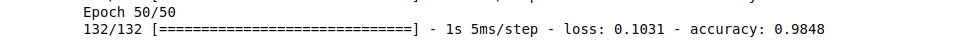
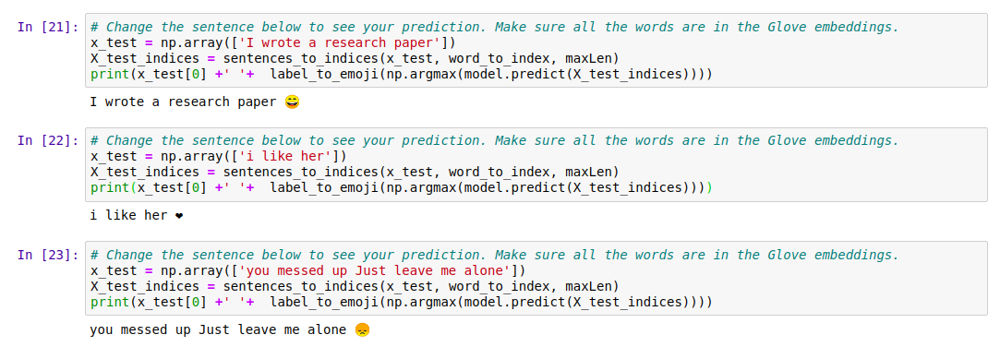

# Emojifier!  

Have you ever wanted to make your text messages more expressive? Your emojifier app will help you do that. 
So rather than writing:
>"Congratulations on the promotion! Let's get coffee and talk. Love you!"   

The emojifier can automatically turn this into:
>"Congratulations on the promotion! 👍 Let's get coffee and talk. ☕️ Love you! ❤️"

This is a NLP project to Predict the Emojis for the Given Text, Using LSTM Structure.

## Baseline model: Emojifier

###  About Dataset emojiset

The dataset (X, Y) where:
- X contains 127 sentences (strings).
- Y contains an integer label between 0 and 4 corresponding to an emoji for each sentence.
- as shown in the below picture.

EMOJISET - a classification problem with 5 classes. A few examples of sentences are given here.

## Inputs and outputs to the embedding layer

* The figure shows the propagation of two example sentences through the embedding layer. 
    * Both examples have been zero-padded to a length of `max_len=5`.

Embedding layer

### Overview of the LSTM model

This is the LSMT structure that we're going use for prediction:

  
Emojifier. A 2-layer LSTM sequence classifier.

### Output Accuracy :
  
Trainset Accuracy of the Emoji Predicted Model.

### Output of the Model:
  
Output of the Model on given String!

This Project is inspired by the Coursera's course on Sequence Models!
